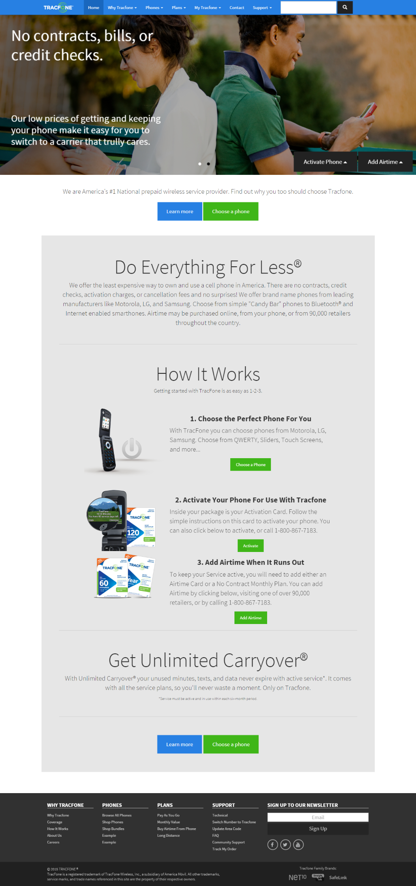
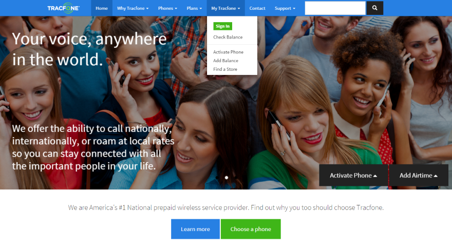
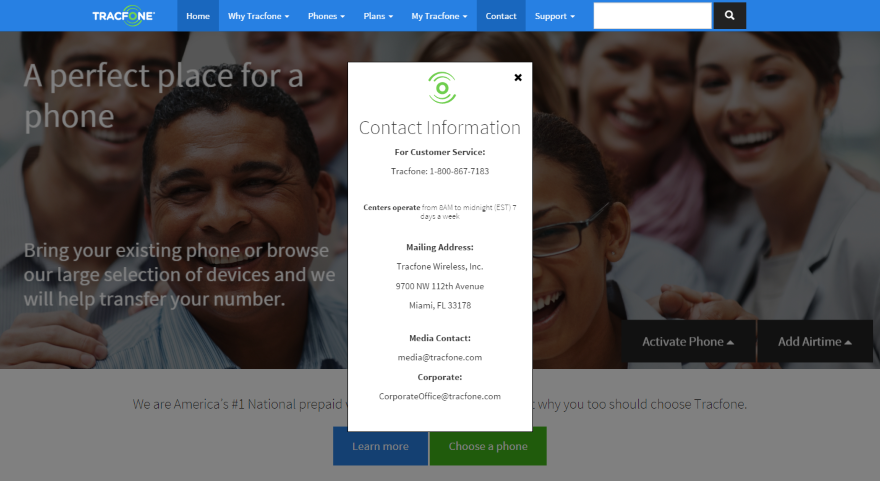
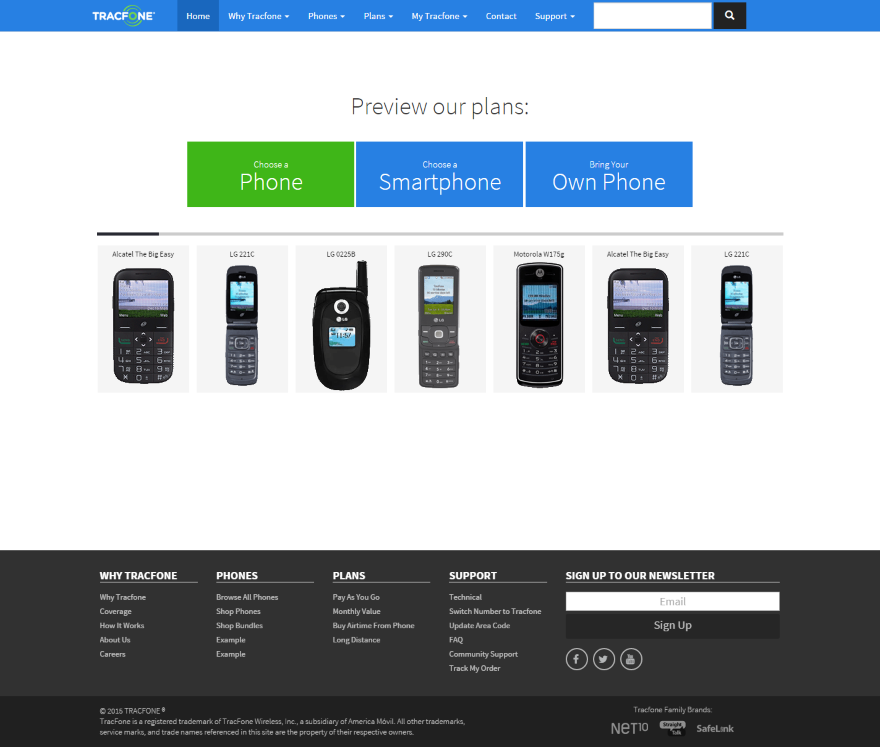
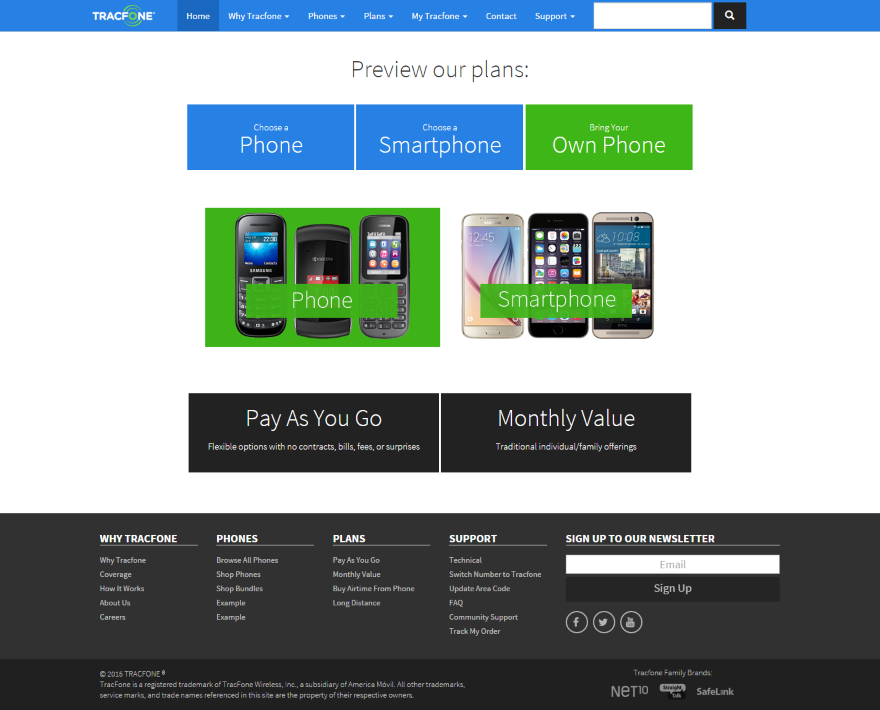
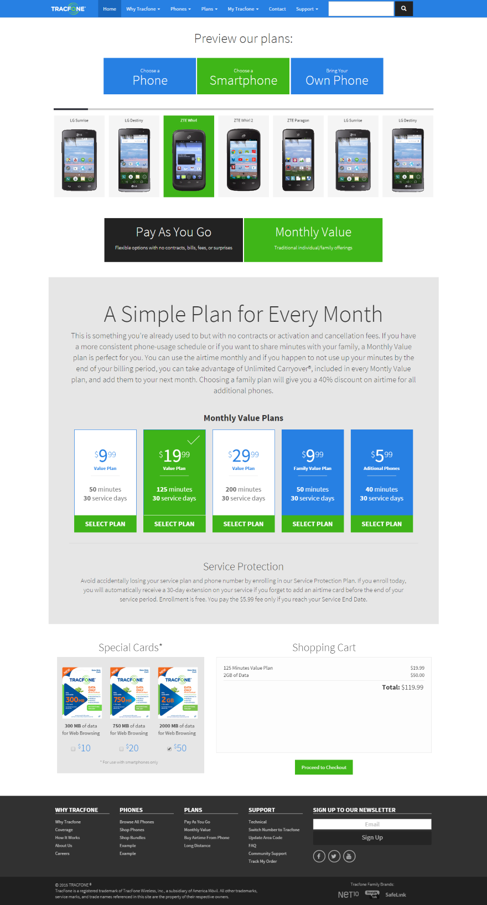
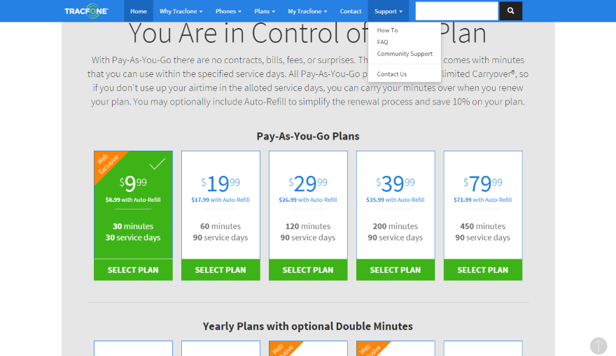

MVNO/Wireless Carrier Website Redesign
=================

For a personal research project, I picked the website of a wireless carrier brand and researched some ground-up improvements that could be made.

The two main goals were simplifying the Home page and merging all Plan pages into a single one-page flow.

> **Some Technologies used:**

> - PHP for integration/view merging
> - Bootstrap for responsive views
> - JQuery for UI/UX
> - WOW.js for some of the animations
> - Jssor for the slides
> - HTML/CSS/JS

New Home page
-------

Simple Sign-In
-------

Contact modal
-------

Phone selection
-------

BYOP / Plan Type selection
-------

Full Plans page after making selections
-------

Plan cards
-------

